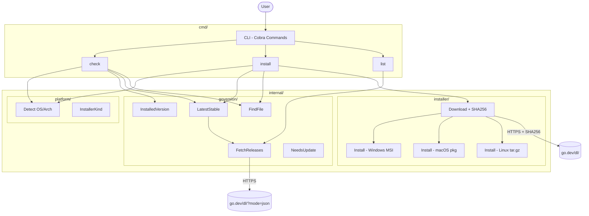
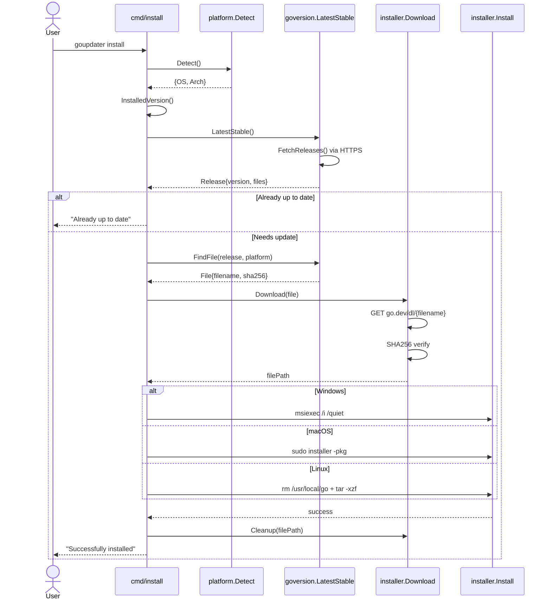

# Architecture

## System Overview

```mermaid
flowchart TB
    User([User]) --> CLI[CLI - Cobra Commands]

    subgraph cmd["cmd/"]
        CLI --> Check[check]
        CLI --> Install[install]
        CLI --> List[list]
    end

    subgraph internal["internal/"]
        subgraph goversion["goversion/"]
            Fetch[FetchReleases]
            Latest[LatestStable]
            FindFile[FindFile]
            Installed[InstalledVersion]
            NeedsUpdate[NeedsUpdate]
        end

        subgraph platform["platform/"]
            Detect[Detect OS/Arch]
            Kind[InstallerKind]
        end

        subgraph installer["installer/"]
            Download[Download + SHA256]
            InstWin[Install - Windows MSI]
            InstMac[Install - macOS pkg]
            InstLin[Install - Linux tar.gz]
        end
    end

    Check --> Detect
    Check --> Installed
    Check --> Latest
    Check --> FindFile

    Install --> Detect
    Install --> Latest
    Install --> FindFile
    Install --> Download
    Download --> InstWin & InstMac & InstLin

    List --> Fetch

    Latest --> Fetch
    Fetch -->|HTTPS| GoAPI[(go.dev/dl/?mode=json)]
    Download -->|HTTPS + SHA256| GoDL[(go.dev/dl/)]
```

## Install Flow

```mermaid
sequenceDiagram
    actor User
    participant CLI as cmd/install
    participant Platform as platform.Detect
    participant API as goversion.LatestStable
    participant DL as installer.Download
    participant Inst as installer.Install

    User->>CLI: goupdater install
    CLI->>Platform: Detect()
    Platform-->>CLI: {OS, Arch}
    CLI->>CLI: InstalledVersion()

    CLI->>API: LatestStable()
    API->>API: FetchReleases() via HTTPS
    API-->>CLI: Release{version, files}

    alt Already up to date
        CLI-->>User: "Already up to date"
    else Needs update
        CLI->>API: FindFile(release, platform)
        API-->>CLI: File{filename, sha256}
        CLI->>DL: Download(file)
        DL->>DL: GET go.dev/dl/{filename}
        DL->>DL: SHA256 verify
        DL-->>CLI: filePath

        alt Windows
            CLI->>Inst: msiexec /i /quiet
        else macOS
            CLI->>Inst: sudo installer -pkg
        else Linux
            CLI->>Inst: rm /usr/local/go + tar -xzf
        end

        Inst-->>CLI: success
        CLI->>DL: Cleanup(filePath)
        CLI-->>User: "Successfully installed"
    end
```
